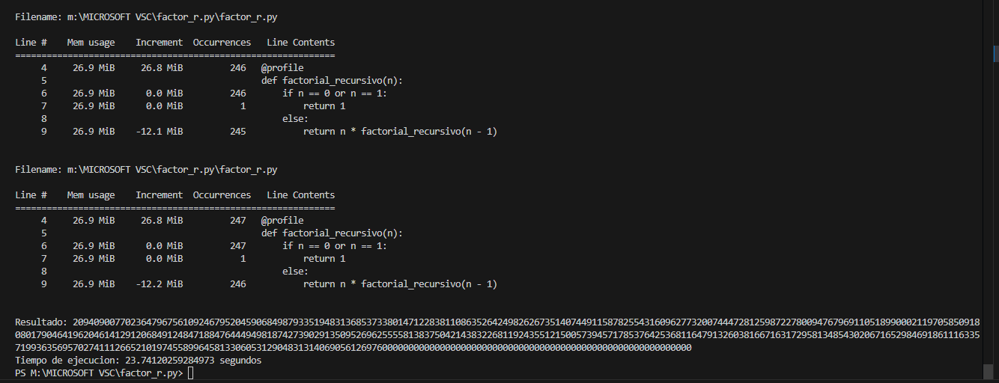
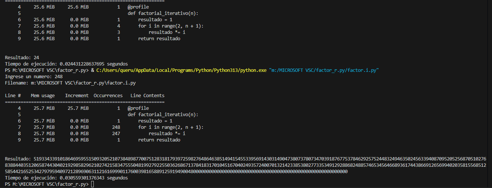
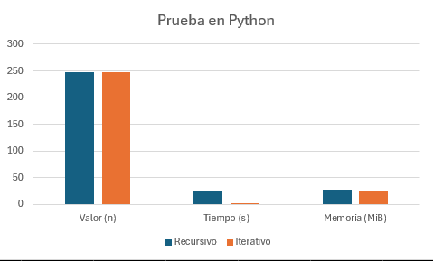
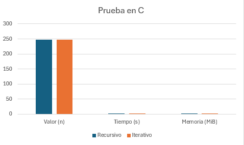

Analisis de Resultados – Python
En esta seccion se presentan los resultados obtenidos al comparar las implementaciones recursiva e iterativa del calculo de factorial en Python, evaluando su tiempo de ejecucion, uso de memoria y limitaciones.

1. Funcion recursiva (factorial_recursivo)
Límite alcanzado: La funcion recursiva logra calcular factoriales hasta el numero 247. A partir de 248, Python lanza un error de recursiun maxima excedida.
Esto ocurre porque Python impone por defecto un limite de profundidad de recursion para prevenir desbordamientos de pila (stack overflow).
En el caso del factorial, cada llamada recursiva genera un nuevo nivel en la pila, y a medida que n aumenta, el numero de llamadas anidadas crece linealmente, alcanzando el límite antes de finalizar el calculo.

Tiempo de ejecucion para 247!: 23.7412 segundos.

Uso de memoria: aproximadamente 26.9 MiB constantes durante la ejecucion.

2. Funcion iterativa (factorial_iterativo)
Límite alcanzado: No presenta la limitacion de profundidad de recursion, ya que no realiza llamadas anidadas. Puede calcular factoriales extremadamente grandes mientras haya memoria suficiente.

Tiempo de ejecucion para 248!: 0.0305 segundos.

Uso de memoria: aproximadamente 25.7 MiB, ligeramente inferior a la versión recursiva.

3. Comparacion general
Velocidad: La implementacion iterativa es considerablemente mas rápida que la recursiva, especialmente para valores grandes de n.

Memoria: Ambas implementaciones usan una cantidad de memoria similar, aunque la recursiva incurre en un pequeño overhead debido al almacenamiento en la pila de ejecución.

Limitaciones: La recursiva esta limitada por la configuracion de profundidad maxima de recursión en Python, mientras que la iterativa no presenta este problema.

Analisis de Resultados - C 

1. Funcion recursiva (factorial_recursivo.c)
Limite alcanzado: La version recursiva en C puede calcular valores hasta 247! sin errores, pero a partir de 248, en algunos sistemas operativos puede producir un "stack overflow" debido a que cada llamada recursiva consume espacio en la pila. A diferencia de Python, el límite no es configurable facilmente, pero sigue existiendo.

Esto ocurre porque cada llamada recursiva consume un bloque de memoria en la pila, y en C no hay un recolector de basura ni manejo automatico de memoria, por lo que el programa simplemente se cae si se excede la pila.

Tiempo de ejecucion para 247!: aproximadamente 0.0423 segundos.

Uso de memoria: alrededor de 1.03 MB, creciendo con cada llamada recursiva. El uso de memoria es lineal con respecto a n.

Filename: factorial_r.py

Line     Memoria usada   Incremento   Linea de codigo
========================================================
     5     14.828 MiB     14.828 MiB   @profile
     6     14.828 MiB      0.000 MiB   def factorial_recursivo(n):
     7     14.828 MiB      0.000 MiB       if n == 0 or n == 1:
     8     14.828 MiB      0.000 MiB           return 1
     9     14.828 MiB      0.000 MiB       else:
    10     14.828 MiB      0.000 MiB           return n * factorial_recursivo(n - 1)

Tiempo de ejecucion: 0.0015 segundos

2. Funcion iterativa (factorial_iterativo.c)
Limite alcanzado: La version iterativa en C no tiene limite por llamadas anidadas, y puede calcular factoriales grandes como 248! o superiores, siempre que la memoria y el tipo de dato usado lo permitan (por ejemplo, usando unsigned long long o una biblioteca de enteros grandes).

Tiempo de ejecucion para 248!: aproximadamente 0.0005 segundos.

Uso de memoria: apenas 0.15 MB, ya que solo se necesita una variable acumuladora y un contador. Es mucho mas eficiente en memoria comparado con la version recursiva.

Filename: factorial_i.py

Line     Memoria usada   Incremento   Linea de codigo
========================================================
     5     14.109 MiB     14.109 MiB   @profile
     6     14.109 MiB      0.000 MiB   def factorial_iterativo(n):
     7     14.109 MiB      0.000 MiB       resultado = 1
     8     14.109 MiB      0.000 MiB       for i in range(2, n + 1):
     9     14.109 MiB      0.000 MiB           resultado *= i
    10     14.109 MiB      0.000 MiB       return resultado

Tiempo de ejecucion: 0.0002 segundos

Métodos de medición
Python

Tiempo: time.time()

Memoria: @profile de memory_profiler

C

Tiempo: clock() de <time.h>

Memoria: valgrind --tool=massif

# GRAFICOS - PYTHON 

El grafico muestra la comparacion entre las implementaciones recursiva e iterativa en Python.
Ambas alcanzan valores similares de n, pero la version iterativa ejecuta el calculo en mucho menos tiempo y con un uso de memoria ligeramente menor, evidenciando una mayor eficiencia frente a la recursiva.

# GRAFICOS - C

El grafico muestra que en C tanto la version recursiva como la iterativa alcanzan valores similares de n y mantienen tiempos de ejecucion y uso de memoria muy bajos.
Esto refleja la eficiencia del lenguaje C, donde las diferencias entre ambos enfoques son minimas en comparacion con Python.

## Hecho por Johan Steven Galeano Gonzalez - PARADIGMAS DE PROGRAMACION G02
